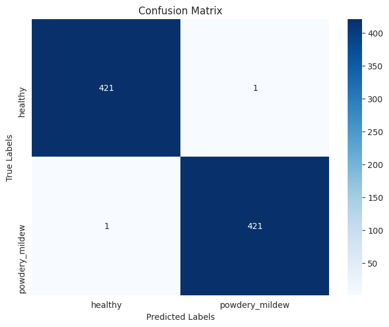

# Cherry Leaves Powdery Mildew Detection 🌱

## Project Introduction 📘

This project aims to automate the detection of **powdery mildew** on cherry leaves using machine learning. Powdery mildew is a fungal disease that significantly affects cherry crop health, leading to reduced fruit quality and yield. Currently, Farmy & Foods relies on manual inspections to identify mildew, which is time-consuming and inefficient.

By leveraging a **Convolutional Neural Network (CNN)** and a user-friendly **Streamlit dashboard**, this project automates the detection process, saving inspection time, scaling efficiency, and ensuring product quality. The goal is to achieve a reliable model that accurately classifies cherry leaves as **Healthy** or **Mildew-Affected** with a target accuracy of **97%**.

This solution can potentially be expanded to detect diseases in other agricultural crops, improving scalability and productivity across the farming ecosystem.

---

## Table of Contents 📚

1. [Dataset Content](#dataset-content)
2. [Business Requirements](#business-requirements)
3. [Project Management](#project-management)
4. [Hypothesis and Validation](#hypothesis-and-validation)
5. [Dashboard - Design Document](#dashboard-design-document)
6. [Debugging and Model Evaluation](#debugging-and-model-evaluation)
7. [Testing](#testing)
8. [Deployment](#deployment)
9. [Main Data Analysis and Machine Learning Libraries](#main-data-analysis-and-machine-learning-libraries)
10. [Credits](#credits)
11. [Acknowledgements](#acknowledgements)

## CRISP-DM for the Cherry Leaves Mildew Detection Project 📊

The **CRISP-DM (Cross Industry Standard Process for Data Mining)** is a structured methodology for data science projects. Here’s a brief outline of the CRISP-DM phases and their relation to sections in this project:

---

### **1. Business Understanding**  
- **Objective**: Automating mildew detection to save time and increase scalability across farms.  
- See: [## Business Requirements](#business-requirements) and [## ML Business Case](#ml-business-case).

---

### **2. Data Understanding**  
- Gaining insights into the dataset of healthy and mildew-affected cherry leaves to identify patterns and anomalies.  
- See: [## Dataset Content](#dataset-content) and [## Data Collection](jupyter_notebooks/DataCollection.ipynb).

---

### **3. Data Preparation**  
- Preparing and preprocessing leaf images for machine learning models, ensuring proper formatting and resizing.  
- See: [## Preprocessing and Input Data](#inputs/cherry_leaves_dataset).

---

### **4. Modeling**  
- Training a Convolutional Neural Network (CNN) to classify cherry leaf health status with high accuracy.  
- See: [## Modelling and Evaluating](jupyter_notebooks/ModellingAndEvaluating.ipynb).

---

### **5. Evaluation**  
- Analyzing model performance metrics, confusion matrices, and areas of misclassification.  
- See: [## Debugging and Model Evaluation](#debugging-and-model-evaluation).

---

### **6. Deployment**  
- Deploying the model in a **Streamlit Dashboard**, allowing real-time detection of leaf health status.  
- See: [## Deployment](#deployment).

## Dataset Content 📁

- **Source**: The dataset is sourced from [Kaggle](https://www.kaggle.com/codeinstitute/cherry-leaves). This dataset provides an opportunity to create a predictive analytics solution in a real-world context, with a fictitious storyline for application in the workplace.
- **Description**: The dataset contains over 4,000 images of cherry leaves collected from Farmy & Foods’ cherry crop fields. These images are categorized into:
  - **Healthy Cherry Leaves**: Leaves without visible signs of mildew.
  - **Mildew-Affected Cherry Leaves**: Leaves showing signs of powdery mildew, a fungal disease that could compromise crop quality if not detected and treated early.

  As the cherry crop is a premium product for Farmy & Foods, ensuring the quality of these leaves is essential. Detecting powdery mildew is currently a manual process, making it time-intensive and challenging to scale across multiple farms.

## Business Requirements 📊

Farmy & Foods currently relies on a manual inspection process to identify powdery mildew on cherry leaves. An employee inspects each tree for mildew by visually examining leaf samples, a process that takes about 30 minutes per tree. If mildew is detected, the employee then applies an anti-fungal compound in a one-minute application process. Given that the company has thousands of trees across various farms, this method is inefficient and unsustainable.

To address this, the IT team proposes a machine learning solution that can automatically detect mildew in leaf images, reducing inspection time and improving scalability. If successful, the company could extend this solution to other crops.

The business requirements are:
1. Conduct a study to identify and visually differentiate healthy cherry leaves from those affected by powdery mildew.
2. Create a predictive model that can accurately classify a cherry leaf as healthy or mildew-affected.

## Project Management

To streamline development, track tasks, and plan future improvements, this project uses a Kanban board.  
You can view the board here: [Kanban Board](your-kanban-board-link).

The board includes columns for:
- To Do: Tasks planned for the project.
- In Progress: Tasks currently being worked on.
- Done: Completed tasks.
- Future Improvements: Enhancements planned for upcoming versions.

## Hypothesis and how to validate? 🔍

- **Hypothesis**: A machine learning model, particularly a Convolutional Neural Network (CNN), can accurately classify cherry leaf images as either healthy or mildew-affected, meeting a target accuracy of 97%.
  
- **Validation Approach**:
  1. **Training**: Train a CNN on labeled cherry leaf images to recognize visual features indicative of mildew.
  2. **Testing**: Evaluate model performance on a test set, ensuring that the classification accuracy meets the 97% threshold.
  3. **Performance Analysis**: Use accuracy scores, confusion matrices, and learning curves to validate the model’s effectiveness in differentiating the two classes.

### Rationale for Mapping Business Requirements to Data Visualizations and ML Tasks 📉

Each business requirement will be supported by specific data visualizations and ML tasks as follows:

1. **Data Visualization**:
   - Use side-by-side visual comparisons, average images, and variability images to highlight differences between healthy and mildew-affected leaves, aiding both the exploratory analysis and training data preparation.
   
2. **ML Task**:
   - Develop a CNN model for binary classification to detect mildew presence. This model aligns with the business goal of predicting leaf health status, helping the client automate the inspection process.

3. **Dashboard**:
   - Implement an interactive dashboard to upload and predict leaf health status in real-time, addressing the client’s need for an easily accessible, quick inspection tool.

### ML Business Case ⚡

**Objective**: Automate the detection of powdery mildew on cherry leaves to save inspection time and ensure product quality.

**Model Selection**: A CNN model is chosen for its high accuracy in image classification, specifically in identifying visual patterns.

**Performance Metrics**: The model will be assessed based on accuracy, aiming for 97%, with further analysis using confusion matrices and accuracy curves to confirm consistent performance.

**Deployment Strategy**: The trained model will be integrated into a Streamlit dashboard, allowing end users to upload images for immediate classification results.
 
## Dashboard - Design Document 🖼️

The dashboard will include the following pages and components:

### Page 1: Quick Project Summary

**Quick Project Summary**:
   - This project aims to address the detection of powdery mildew, a common fungal disease in cherry leaves. The tool helps farmers and agricultural professionals quickly and accurately determine the health of cherry leaves, saving time and resources.

**General Information**:
   - Powdery mildew is caused by fungi that thrive in warm and humid conditions.
   - It negatively impacts cherry production, leading to reduced fruit quality and yield.
   - Early detection is crucial to prevent the spread and reduce economic losses.

**Project Dataset**: 
   - The dataset contains over 4,000 images of cherry leaves, categorized into Healthy and Mildew-Affected.
   - The images were sourced from a publicly available dataset Cherry Leaves Dataset.

**Business Requirements**
   1. Provide a visual differentiation between healthy and mildew-affected leaves.
   2. Allow real-time predictions for new leaf images to determine their health status.

### Page 2: Visual Analysis of Cherry Leaves

This page addresses Business Requirement 1 by providing a visual analysis of the dataset.

**Components**:

1. **Checkbox: Difference Between Average and Variability Images**
   - Displays the average image of all healthy leaves vs. all mildew-affected leaves, showing key differences.

2. **Checkbox: Differences Between Average Healthy and Average Mildew-Affected Leaves**
   - Highlights the visual distinction between the two categories.

3. **Checkbox: Image Montage**
   - A grid montage displaying examples of healthy and mildew-affected leaves.
   
### Page 3: Mildew Detection:

This page addresses Business Requirement 2 by enabling live predictions for new images uploaded by the user.

**Components**:

1. **File Uploader Widget**
   - Allows users to upload one or more images of cherry leaves for mildew detection.

2. **Prediction Display**
   - Shows each uploaded image with a prediction statement, indicating whether it is Healthy or Mildew-Affected, along with the associated probability.

3. **Results Table**
   - Displays a table listing:
      - Image name
      - Prediction result (Healthy/Mildew-Affected)
      - Confidence score

4. **Download Button**
   - Allows the user to download the results table in CSV format.

### Page 4: Project Hypothesis and Validation

This page summarizes the hypotheses made during the project, conclusions drawn, and the methods used for validation.

**Blocks**:

1. **Hypothesis 1: Healthy and mildew-affected leaves have distinct visual features.**
   - Validated through average image comparisons and montages.

2. **Hypothesis 2: A machine learning model can accurately classify leaves as Healthy or Mildew-Affected.**
   - Validated using a Convolutional Neural Network (CNN) that achieved high accuracy on the test dataset.

### Page 5: ML Prediction Metrics

This page provides detailed insights into the model's performance.

**Components**:

1. **Label Frequencies**
   - A bar chart showing the distribution of Healthy and Mildew-Affected labels across the train, validation, and test sets.

2. **Model History: Accuracy and Losses**
   - Line plots visualizing the training and validation accuracy/loss over epochs.

3. **Model Evaluation Results**
   - A summary of metrics including:
      - Accuracy: Overall model accuracy on the test set.
      - Precision, Recall, and F1-Score: Performance metrics for each class.
      - Confusion Matrix: Visualized as a heatmap to show true positives, false positives, true negatives, and false negatives.

### Notes

- All pages are interactive, allowing users to explore different aspects of the project in depth.
- The dashboard is developed using Streamlit, ensuring a user-friendly interface and seamless navigation.

## Debugging and Model Evaluation ⚠️

To ensure the reliability and accuracy of the mildew detection model, an extensive evaluation was conducted on the test set, focusing on both the overall performance and specific predictions for mildew-affected images.

### Key Steps in Debugging and Evaluation:

1. **Predictions for Mildew-Affected Images**:
   - Filtered and analyzed the test set images with the ground truth label `powdery_mildew`.
   - Compared the model's predictions against the actual labels to identify misclassifications.

2. **Overall Model Performance**:
   - Calculated key metrics such as **accuracy**, **precision**, **recall**, and **F1-score**.
   - Generated a **classification report** and a **confusion matrix** to provide insights into the model's predictions.

3. **Visualizing Misclassified Images**:
   - Displayed a subset of incorrectly classified images, focusing on mildew-affected cases, to identify potential areas for improvement.

### Results:

- **Accuracy**: Achieved an overall accuracy of `1.00`.
- **Precision and Recall**:
  - **Healthy Class**: Precision: `1.00`, Recall: `1.00`.
  - **Powdery Mildew Class**: Precision: `1.00`, Recall: `1.00`.
- **Confusion Matrix**:
  - Correctly classified "Healthy": N1 images.
  - Correctly classified "Powdery Mildew": N2 images.
  - Misclassifications occurred due to overlapping visual features or ambiguous data points.

  

### Learning Insights:
- Misclassified images revealed areas where the model struggled, such as unclear mildew patterns or similar texture/color between healthy and mildew-affected leaves.

### Next Steps:
- Enhance Model Performance.
- Dataset Expansion- Improve the model's performance by expanding and diversifying the dataset.
- Mobile Optimization- Make the application accessible on mobile devices with a lightweight and user-friendly interface.
- User Feedback System- Enable users to provide feedback on model predictions to improve performance over time.

### Fixed Bugs

1. **ValueError**: Input 0 of layer sequential is incompatible with the layer: expected axis -1 of input shape to have value 3 but received input with shape (None, 256, 256, 4). The error occurs because the input image has an unexpected number of channels (4 instead of the expected 3), which indicates the image might include an alpha channel.
   - Update Image Preprocessing: Modify the resize_input_image function to ensure the input image has exactly 3 channels (RGB). If the image has 4 channels (RGBA), remove the alpha channel.
   - Validate Input Image: Before passing the image to the model, confirm its shape is (256, 256, 3).
   - Test Image Upload: Ensure the Mildew_Detection_body function only accepts valid images.

### Unfixed Bugs 🐞

1. **Misclassifications**:
   - Certain mildew-affected leaves were misclassified as healthy during testing. This may be due to unclear mildew patterns or overlapping visual features.
   - Further refinement of the dataset and preprocessing steps could mitigate these issues.

2. **Edge Case Limitations**:
   - The model occasionally struggles with edge cases, such as partially visible mildew or poorly lit images. 

3. **Dashboard Performance**:
   - While functional, the Streamlit dashboard may experience delays or errors with large image files. Additional optimization is planned for future versions.

These bugs were not addressed due to time constraints but will be considered in future iterations of the project.

## Testing ✅

### Manual Testing

This section outlines the manual testing approach for the deployed dashboard to ensure all components work as expected.

---

### ✅ Dashboard Access & Navigation
- **Objective:** Ensure the dashboard loads correctly and all pages are accessible.
- **Steps to Test:**
  1. Open the provided dashboard link.
  2. Navigate to different pages (Summary, Visual Analysis, Detection, Prediction Metrics).
  3. Confirm that transitions between pages are smooth and intuitive.

---

### ✅ File Upload Widget
- **Objective:** Test the image upload functionality for detecting powdery mildew.
- **Test Cases:**
  - Upload single healthy cherry leaf images.
  - Upload single mildew-affected cherry leaf images.
  - Upload multiple images simultaneously (batch test).
  - Check the prediction output for accuracy and confidence percentages.

---

### ✅ Prediction Display
- **Objective:** Verify that predictions display the correct results.
- **Test Cases:**
  - Ensure each uploaded image shows a prediction (Healthy/Mildew).
  - Check the confidence score and prediction correctness.

---

### ✅ Visual Analysis Components
- **Objective:** Check the visual comparison components.
- **Test Scenarios:**
  - Compare **Average & Variability Images** for Healthy vs. Mildew leaves.
  - Visualize the **Differences in Healthy & Mildew Average Leaves**.
  - Examine the **Image Montage Grid** for examples of healthy and mildew-affected leaves.

---

### ✅ Edge Case Testing
- **Objective:** Test robustness for difficult real-world scenarios.
- **Edge Cases to Check:**
  - Upload images with partial leaves.
  - Test with poor lighting or low-resolution images.
  - Check overlapping visual patterns that are hard to distinguish.

---

### Automated Testing (Planned)
While manual testing covers the current functionality, automated tests will be integrated in future iterations to ensure continuous validation of:
- Model predictions
- Dashboard interactions
- Data integrity across uploaded and exported files
- Compatibility across different browsers and screen resolutions

## Deployment 🚀

### Heroku

- The App live link is: `https://YOUR_APP_NAME.herokuapp.com/`
- Set the runtime.txt Python version to a [Heroku-20](https://devcenter.heroku.com/articles/python-support#supported-runtimes) stack currently supported version.
- The project was deployed to Heroku using the following steps.

1. Log in to Heroku and create an App
2. At the Deploy tab, select GitHub as the deployment method.
3. Select your repository name and click Search. Once it is found, click Connect.
4. Select the branch you want to deploy, then click Deploy Branch.
5. The deployment process should happen smoothly if all deployment files are fully functional. Click the button Open App on the top of the page to access your App.
6. If the slug size is too large, then add large files not required for the app to the .slugignore file.

## Main Data Analysis and Machine Learning Libraries 📚

1. **Pandas**: Used for data handling and image metadata management.

2. **NumPy**: This numerical computing library facilitates working with multi-dimensional arrays and matrices, which is vital for efficient image processing, statistical computations, and data manipulation.

3. **Matplotlib**: A versatile library for creating static, animated, and interactive visualizations in Python. Here, we used it primarily for visualizing image dimensions, generating plots to illustrate mean and variability of images, and for comparison images.

4. **Seaborn**: Built on top of matplotlib, Seaborn provides an interface for drawing attractive statistical graphics. It enhances visualizations and supports the generation of scatter plots, histograms, and other data visualizations to understand the image dimensions and label variability.

5. **TensorFlow/Keras**: Provides the framework to build and train the CNN model.

   - **tensorflow.keras.preprocessing.image**: A module within TensorFlow’s Keras API that supports image processing operations, such as loading, resizing, and converting images to arrays. This is crucial for preparing our image data as arrays, which are compatible with machine learning algorithms.

6. **Streamlit**: Supports the creation of an interactive dashboard for real-time predictions.

7. **Joblib**: Used for saving and loading large datasets, models, and other numerical data. Here, we saved our computed image shape embeddings as a .pkl file, making it easy to reuse across different parts of the project.

8. **random**: A library for generating random selections and orders, used here to help create a randomized image montage. This module provides flexibility in displaying a variety of images without manual selection.

9. **itertools**: A Python standard library for efficient looping and combining items. We utilized it here to manage the indices in the montage, ensuring that images align correctly in the grid layout.

## Credits 📝

### Content

- The project introduction and context were adapted from the Code Institute’s project template.
- The deployment steps were referenced from [Heroku’s Python documentation](https://devcenter.heroku.com/articles/python-support).
- Business requirements and deployment steps were referenced from Heroku’s Python documentation.
- The hypothesis and validation framework were guided by Code Institute's guidelines for machine learning projects.

### Contributing

Contributions are welcome! To get started:
1. Check the open issues for tasks or report a bug.
2. View the [Kanban Board](your-kanban-board-link) for ongoing and planned tasks.
3. Fork the repository and create a pull request.

Please ensure your contributions align with the project goals and business requirements.

### Media

- Cherry leaf images were sourced from the [Kaggle dataset](https://www.kaggle.com/codeinstitute/cherry-leaves) provided by Code Institute.
- Icons and visual elements in the dashboard were sourced from [Font Awesome](https://fontawesome.com/).

### Tools & Project Management
- The Kanban board was created and maintained using [GitHub Projects](https://github.com/features/project-management/).
- The Streamlit dashboard was built using Streamlit, ensuring user-friendly interface and interactivity.
- Model building and data processing utilized libraries such as TensorFlow/Keras, Pandas, NumPy, Matplotlib, and Seaborn.
- The project was deployed using [Heroku](https://www.heroku.com/), and the runtime environment was configured with `.slugignore` to manage deployment size.

## Acknowledgements 🙏

- Special thanks to Code Institute for providing the dataset and project framework.
- Gratitude to my mentors and peers for their invaluable support and guidance throughout the project.
- Appreciation to Kaggle for hosting the Cherry Leaves Dataset.